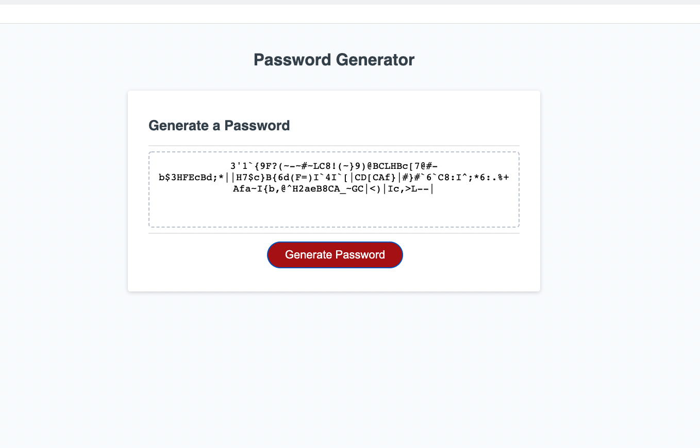

# Password Generator

This is a random password generator. When application is iniialized, users will be prompted for: password length of 8 to 128 characters, lowercase letters, uppercase letters, numbers, and symbols:
Users must choose at least one criteria in order for the application to continue. Once criteria are met, the application will generate a password based on the users' prompted input.

## Getting Started

Please click on the links below to go to the repository:
* [GitHub Repository](https://github.com/vengster/password-generator)

Please click on this link below to go to the deployed application:
* [Deployed Application](https://vengster.github.io/password-generator)

### Prerequisites

A web browser and internet connection. 

### Summary
* HTML and CSS and Javascript documents create a random password generator 
* This project emphasizes the use of using Javascript to make dynamic changes to an HMTL document

### This project has the following features: 
* When "generate password" button is clicked:
    * User will be prompted for certain criteria they would like in their password.
    * Once the prompts are done, the application will generate a password according to user input via prompts and display in the text area.

## Authors

* **Veng Lee** - [Git Hub Profile](https://github.com/vengster)

## Acknowledgments

* [google](https://www.google.com)

